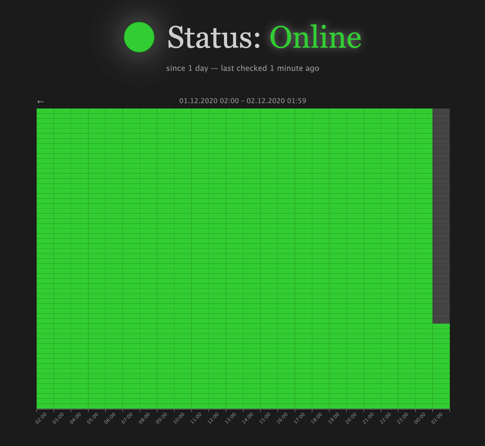

# track-online-status

[](https://www.npmjs.com/package/track-online-status?activeTab=dependencies)
[](https://github.com/simbo/track-online-status/commits/master)
[](https://github.com/simbo/track-online-status)
[](http://simbo.mit-license.org/)

> A simple tool to track the online status of my home internet connection.

---

## About

I run this little thing on one of my raspberry pis at my home to keep track of
the internet connection state.

### Screenshot



## Requirements

A small server in your LAN with…

- nginx (or any other webserver)
- nvm with node.js >= 14
- yarn

## Setup

```sh
cd ~
git clone git@github.com:simbo/track-online-status.git
cd track-online-status
yarn
yarn build
```

### nginx

```sh
sudo nano /etc/nginx/sites-available/default
```

```nginx
  location /online-status {
    alias /home/simbo/track-online-status/public/;
  }
```

```sh
sudo nginx -s reload
```

### cron

```sh
crontab -e # create/edit user crontab
```

```cron
# run online status test every minute
* * * * * /home/simbo/track-online-status/bin/cron-test-online-status
```

### update script

```sh
touch ~/bin/update-track-online-status
chmod +x ~/bin/update-track-online-status
nano ~/bin/update-track-online-status
```

```sh
#!/bin/bash
cd /home/simbo/track-online-status
git fetch
git pull
yarn
yarn build
```

## License

[MIT &copy; Simon Lepel](http://simbo.mit-license.org/)
